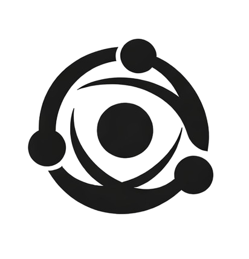

  

# Rasbhari

Rasbhari is an event-driven personal operating system for Raspberry Pi and lightweight Linux hosts.

It is built around a calm operating loop: capture, structure, commit, grow, reflect, and act.

Key surfaces:

- `Dashboard` for the home surface
- `Capture` for quick logging
- `Promises` for commitments
- `Reports` for reflection
- `Automation` for capture automation
- `rTV` for owned local movies
- pull-based local agent runs that let Kanban tickets on Rasbhari queue work for Codex, Gemini, or dry-run workers on a laptop

Docs:

- [Docs Hub](docs/README.md)
- [Rasbhari Overview](docs/rasbhari.md)
- [Experience Modes](docs/experience-modes.md)
- [Automation](docs/automation.md)
- [Home Assistant Integration](docs/home-assistant.md)
- [AI Command Layer](docs/AI.md)
- [macOS Local Signals and Agent Worker](docs/mac-agent.md)
- [Setup Guide](docs/setup.md)
- [Environment Reference](docs/environment.md)
- [rTV Test Loop](docs/rtv-test-loop.md)
